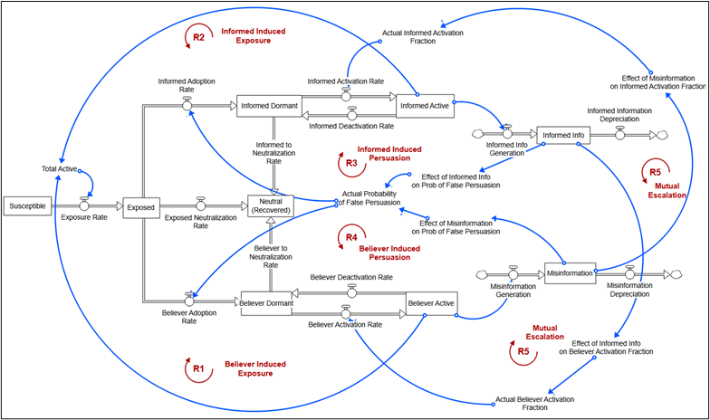

## Dynamic Analysis of False Information Spread Over Social Media: 5G-COVID 19 Conspiracy Theory
 
### Short Problem Description
False information spread is classified as one of the current threats to modern society according to the World Economic Forum (Lee Howell et al., 2013). Perhaps the most recent example demonstrating the potential harms of misinformation is the “infodemic” during the COVID-19 crisis, with results such as various ineffective and possibly harmful remedies, to outright rejection of the existence of the virus (Pennycook et al, 2020). It can misguide people where collective action is needed, such as corruption, vaccination, or climate action. Large masses of people can be manipulated by the false accusations of people with ulterior motives (Varol et al., 2017). Even in situations where false information spread is transient and followed by a corrective action such as retractions, in some cases its influence over people continues, often referred to as the “stickiness” of the misinformation (Lewandowsky et al., 2012). 

Mitigation strategies usually act as symptom relief rather than a structural solution. Immense research on fake news detection methods with data science also paves the way for the development of advanced bots (Ammara, Bukhari, and Qadir, 2020). Warning labels, which is one of the mainstream methods adopted by social media platforms, often create an “Implied Truth Effect” on unlabeled content (Penycook 2020) or they may cause increased web traffic for the labeled content (Ingram, 2017). Fact-checking services try to verify the accuracy of the contents whereas the increase in the rate of information production is immense compared to expansion in the capacity of the confirmation services (Penycook & Rand, 2019). The failure of the current mitigation strategies, despite the enormous efforts both in research and application, stems from the need for a complex systems approach. Therefore, a holistic view of the problem that incorporates the insights of the current literature can point out the possible leverage points and policy resistances to obtain structural remedies to the problem at hand. 

 
### Aim:   
The main objective is to build a formal dynamic simulation model to i) identify the causal feedback structure to gain insights on governing dynamics, ii) evaluate the possible structural mitigation strategies, and iii) discuss the similarities and disparities of the general structure for different cases of misinformation. Epidemiological SIR models of information diffusion constitute a basis for such a task as they are useful to capture the basic behaviors of such systems. However, given their aggregate nature, these models lack the problem-specific causal mechanisms or definitions to investigate misinformation dynamics. For example, traditional SIR models can never produce a reoccurring incidence burst of false information or they are unable to distinguish the dynamics between opposing sides on an issue as such a distinction is not present in the definition of the SIR model. Thus, utilizing the valuable insights presented in the misinformation literature, we aim to expand the current SIR models of information diffusion by adding problem-specific definitions and mechanisms to provide a systemic view of the problem. As a roadmap, we start with the simplest SIR model, expand the model gradually to model a specific case determined as the spread of rumors about the relationship between 5G technology and COVID-19, discuss the structural properties, dynamic behavior patterns, and effect of possible mitigation strategies, and then conclude with possible differences or similarities with other cases of misinformation. 

### References:
* Ammara, U., Bukhari, H., & Qadir, J. (2020). Analyzing Misinformation Through The Lens of Systems Thinking. Tto, 55–63.

* Ingram, M. (2017). Facebook fact checking can make news spread even faster. Available at: http://fortune.com/2017/05/16/facebook-fact-checking.

* Lee Howell et al. (2013). Digital wildfires in a hyperconnected world. WEFReport, 3:15–94.

* Lewandowsky, S., Ecker, U. K. H., Seifert, C. M., Schwarz, N., & Cook, J. (2012). Misinformation and Its Correction: Continued Influence and Successful Debiasing. Psychological Science in the Public Interest, Supplement, 13(3), 106–131. https://doi.org/10.1177/1529100612451018

* Pennycook, G., McPhetres, J., Zhang, Y., Lu, J. G., & Rand, D. G. (2020). Fighting COVID-19 Misinformation on Social Media: Experimental Evidence for a Scalable Accuracy-Nudge Intervention. Psychological Science, 31(7), 770–780. https://doi.org/10.1177/0956797620939054

* Pennycook, G., & Rand, D. G. (2019). Fighting misinformation on social media using crowdsourced judgments of news source quality. Proceedings of the National Academy of Sciences, 116(7), 2521 LP – 2526. https://doi.org/10.1073/pnas.1806781116

* Shin J, Jian L, Driscoll K, Bar F. (2018). The diffusion of misinformation on social media: Temporal pattern, mes- sage, and source. Computers in Human Behavior. 83:278–287. https://doi.org/10.1016/j.chb. 2018.02.008 

* Varol, O., et al. (2017) in Proceedings of the 11th AAAI Conference on Web and Social Media (Association for the Advancement of Artificial Intelligence, Montreal), pp. 280–289.

### [Conference Paper](ISDC-2022 Barry Richmond Application (1).pdf)
